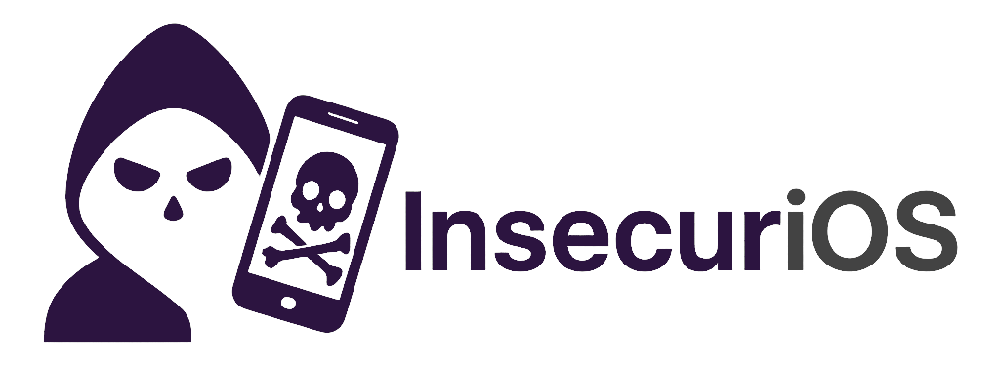

<div align="center">



</div>

InsecuriOS Labs is an educational iOS application designed to demonstrate and practice hacking and pentesting techniques on iOS devices. The application implements various common protections found in commercial iOS apps, allowing students, security researchers, and developers to learn how these protections work and how they can be bypassed using tools such as LLDB, Frida, Reverse Engineering, Patching, and more.

## About This Project

The challenges presented in this application are intentionally basic and designed to help those who are just starting their journey in iOS security research and reverse engineering.

I developed this application a long time ago while I was learning iOS security myself. The goal is to provide a learning environment for beginners, where you can practice fundamental techniques in a safe and controlled setting.

**Using AI to solve challenges:**

There's absolutely no problem with using AI tools to help you solve these challenges. The primary intention is that you're always learning. Yes, there are many tweaks and tools available that can easily bypass these protections, but ask yourself: **Do you really know how to do this manually?**

If the answer is no, then this project is good for you. It will help you understand:
- How the code works on the defensive side
- How to practice manual techniques and understand the underlying mechanisms
- The fundamentals before moving on to more advanced challenges

Remember, the goal isn't just to bypass the protections, it's to understand **how** and **why** they work, and how to manipulate them at a low level. This foundation will be invaluable as you progress to more complex security research.

## Table of Contents

- [Implemented Protections](#implemented-protections)
  - [Biometrics (Touch ID / Face ID)](#biometrics-touch-id--face-id)
  - [Data Storage](#data-storage)
  - [Jailbreak Detection](#jailbreak-detection)
  - [SSL Pinning](#ssl-pinning)
  - [Instrumentation](#instrumentation)
- [Requirements](#requirements)
- [Installation](#installation)
- [References](#references)

## Implemented Protections

### Biometrics (Touch ID / Face ID)

**Objective:**
Practice techniques to bypass biometric authentication (Touch ID / Face ID) using patching tools and runtime manipulation.

**Description:**
This module presents two different implementations of biometric authentication:
- Swift Implementation: Uses LocalAuthentication framework with Swift
- Objective-C Implementation: Uses LocalAuthentication framework with Objective-C

Each implementation demonstrates how weak biometric authentication works and provides opportunities to learn bypass techniques using patching tools and runtime manipulation.

---

### Data Storage

**Objective:**
Practice intercepting sensitive data stored in Keychain and NSUserDefaults, including data that is saved and immediately deleted.

**Description:**
This module presents challenges for intercepting data stored in native iOS mechanisms:
- Keychain: Intercept data before immediate deletion
- NSUserDefaults: Capture temporary data stored in UserDefaults
- Keychain Dump: Find hidden persistent keys

Data is saved and deleted quickly, requiring dynamic interception techniques to capture it before it's removed.

---

### Jailbreak Detection

**Objective:**
Practice techniques to bypass multiple jailbreak detection implementations, from simple checks to commercial libraries and low-level implementations.

**Description:**
This module presents four different variations of jailbreak detection:
- Swift Implementation: Checks URL schemes, suspicious files, writable directories, symbolic links, and tweak libraries
- Objective-C Implementation: Checks URL schemes, suspicious files, writable directories, symbolic links, and tweak libraries
- External Library: Uses external security tools
- Dynamic Library (dylib): Low-level implementation loaded dynamically

Each implementation demonstrates different detection techniques, providing a complete environment to learn and test bypass methods.

---

### SSL Pinning

**Objective:**
Explore different SSL Certificate Pinning implementations and techniques to bypass them, enabling analysis of intercepted HTTPS traffic.

**Description:**
SSL Pinning is a security technique that ensures only specific certificates are accepted during HTTPS communications. This module presents three different implementations:
- URLSession
- Alamofire
- TrustKit

Each implementation demonstrates different approaches to certificate pinning, offering varied opportunities to learn bypass techniques.

---

### Instrumentation

**Objective:**
Learn to bypass anti-debugging protections, detect instrumentation tools, and practice method patching techniques to modify application behavior at runtime.

**Description:**
This module presents challenges related to protections against debugging, instrumentation detection, and application modification:
- Anti-Debugging: Protections that detect and prevent debugger attachment
- Frida Server Detection: Detection of dynamic instrumentation tools via port checking
- Method Patching: Challenges to modify method behavior at runtime

These techniques are fundamental to understanding how protected applications detect dynamic analysis and instrumentation tools, and how these protections can be bypassed.

---

## Requirements

- **iOS**: 13.0+
- Requires physical device with Jailbreak

---

## Installation

### Option 1: Install IPA File

#### Using TrollStore

1. Download the `.ipa` file from the repository releases
2. Transfer the `.ipa` file to your iOS device
3. Open TrollStore on your device
4. Tap "Install" and select the `.ipa` file
5. The app will be installed and ready to use

#### Using Xcode Organizer

1. Download the `.ipa` file from the repository releases
2. Connect your iOS device to your Mac
3. Open Xcode and go to **Window** > **Devices and Simulators**
4. Select your device from the left sidebar
5. Click on **Installed Apps** section
6. Click the **+** button and select the `.ipa` file
7. The app will be installed on your device

---

### Option 2: Build from Source (Manual)

1. Clone the repository:
```bash
git clone https://github.com/kelvinmontini/InsecuriOS-Labs.git
cd InsecuriOS-Labs
```

2. Open the project in Xcode:
```bash
open "InsecuriOS Labs.xcodeproj"
```

3. Configure your Team ID and Bundle Identifier in the project settings

4. Build the project with **Profiling** scheme:
   - Select **Product** > **Scheme** > **InsecuriOS Labs**
   - Select **Product** > **Destination** > Your connected device
   - Build using **Product** > **Profile**

5. Locate the built `.app` file:
   - Right-click on the app in Xcode's Products folder
   - Select **Show in Finder**
   - Or navigate to: `~/Library/Developer/Xcode/DerivedData/InsecuriOS_Labs-<hash>/Build/Products/Release-iphoneos/InsecuriOS Labs.app`

6. Create a ZIP archive of the `.app` file:
```bash
cd ~/Library/Developer/Xcode/DerivedData/InsecuriOS_Labs-<hash>/Build/Products/Release-iphoneos
zip -r "InsecuriOS Labs.app.zip" "InsecuriOS Labs.app"
```

7. Transfer the ZIP file to your iOS device

8. Install using TrollStore or any app installer that supports `.ipa` files

---

## References
- [IOSSecuritySuite](https://github.com/securing/IOSSecuritySuite)
- [Advanced Apple Debugging & Reverse Engineering](https://www.kodeco.com/books/advanced-apple-debugging-reverse-engineering/v4.0)

### Similar Projects
- [DVIA-v2](https://github.com/prateek147/DVIA-v2): Damn Vulnerable iOS App
- [iGoat-Swift](https://github.com/OWASP/igoat-swift): OWASP iGoat
- [frida-ios-playground](https://github.com/NVISOsecurity/frida-ios-playground): Frida iOS Playground

---

## Disclaimer

**Note:** This README was generated with the assistance of LLM tools. English is not my primary language, so I used AI assistance to ensure clarity and proper documentation. If you notice any language issues or have suggestions for improvement, feel free to contribute! :)

This project is for educational purposes only. The use of hacking techniques on applications without authorization is illegal. Use responsibly and only in controlled environments or with explicit permission.